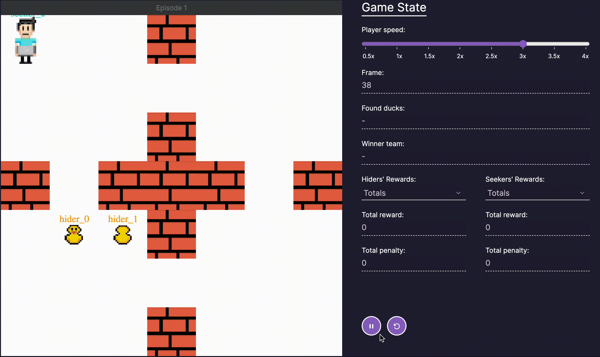

# Welcome to QUACK!
QUACK is not just any educational tool; it aims at making complex reinforcement learning concepts approachable and fun. Inspired by the practice of 'rubber duck debugging' 
where programmers interrogate their rubber duck with questions, QUACK brings you a unique learning experience with hide-and-seek games featuring programmers and ducks.

So dive into the world of Multi-Agent Reinforcement Learning (MARL), explore various algorithms, and watch as our agents learn and evolve through game strategies.
Whether you are a seasoned programmer or new to the world of artificial intelligence, QUACK is the perfect place to witness multi-agent reinforcement learning in action.
